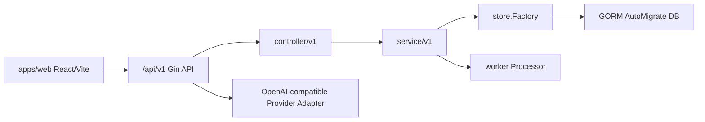

# 系统总览

生成日期：2026-06-26

## 1. 系统定位

OmniMAM 当前代码体现为一个面向 AI 能力管理、资产管理、异步任务和画布工作流的 Web + Go 后端系统。

代码证据：

- `apps/web/src/App.tsx`：Web 应用入口、导航和页面路由。
- `backend/internal/apiserver/route.go`：后端 `/api/v1` API 路由。
- `backend/internal/apiserver/service/v1/service.go`：后端 service 聚合入口。
- `backend/internal/apiserver/server.go`：数据库 schema 初始化和 server 构建。
- `backend/apis/iapiserver/meta_*.go`：数据库模型和 API 元数据。

## 2. 当前架构

| 层 | 说明 | 证据 |
|---|---|---|
| Web | React + Vite + TypeScript，路由集中在 `App.tsx`。 | `apps/web/package.json`、`apps/web/src/App.tsx` |
| API | Gin 注册 `/api/v1` 路由。 | `backend/internal/apiserver/route.go` |
| Controller | 各模块 Handler 位于 `controller/v1`。 | `backend/internal/apiserver/controller/v1/*` |
| Service | 业务逻辑按 asset、canvas、identity、platform、prompt、setting 分包。 | `backend/internal/apiserver/service/v1/service.go` |
| Store | Store factory 抽象数据访问，PostgreSQL 实现位于 `store/postgresql`。 | `backend/internal/apiserver/store/factory.go`、`backend/internal/apiserver/store/postgresql` |
| DB | 启动时通过 GORM AutoMigrate 建表。 | `backend/internal/apiserver/server.go`、`backend/internal/apiserver/store/postgresql/0_pg.go` |
| Worker | taskworker 使用异步任务处理器。 | `backend/cmd/taskworker/taskworker.go`、`backend/internal/apiserver/worker/processor.go` |

## 3. 模块状态概览

| 模块 | 状态 | 说明 |
|---|---|---|
| Web 应用壳 | 可用 | 具备路由、导航、权限过滤和 `GET /me` 能力加载。 |
| 模型提供商管理 | 可用 | 具备 Web 页面、provider/model/system config 接口和表模型。 |
| 平台资产管理 | 可用 | 具备 Web 页面、上传/分片上传/搜索/预览接口和表模型。 |
| 异步任务管理 | 可用 | 具备 Web 页面、任务 API、Task 表和 worker processor。 |
| 画布工作流 | 可用 | 具备 Web 列表/编辑器、画布 API、运行 API 和表模型。 |
| 素材库 | 部分可用 | 后端 CRUD 存在，未发现 Web 独立页面。 |
| 提示词库 | 部分可用 | 后端 CRUD 存在，未发现 Web 独立页面。 |
| 认证与 SSO 设置 | 部分可用 | 后端 OTP/SSO/设置接口存在，未发现 Web 配置页面。 |
| 身份与权限 | 开发中 | 当前用户能力和数据模型存在，未发现完整用户/角色管理页面与 CRUD。 |
| 存储后端 | 部分可用 | 后端接口和表模型存在，未发现 Web 独立页面。 |

## 4. 待确认

- 当前文档基于静态代码扫描，不代表已完成运行时 smoke check。
- 数据库外键、生产数据、部署环境和鉴权策略需结合实际环境确认。
- 审计日志能力未发现明确代码证据，状态为未知。
